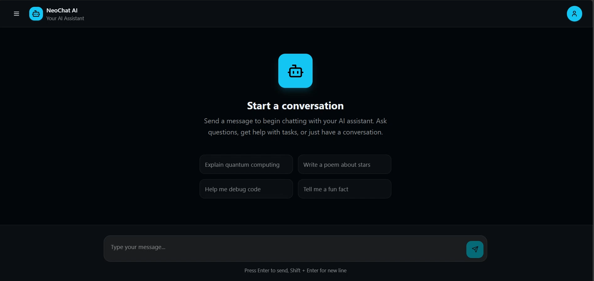
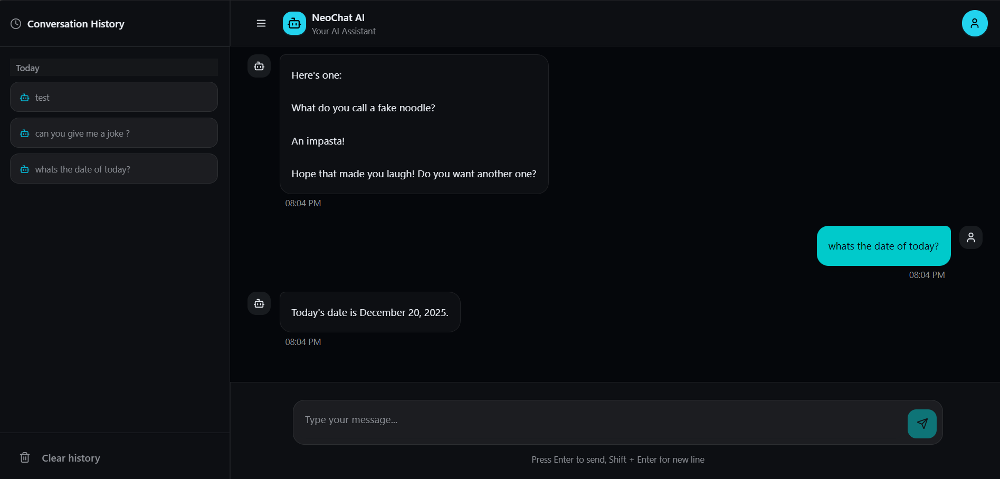
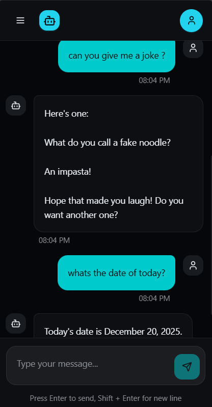
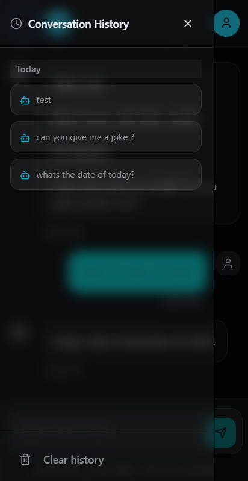
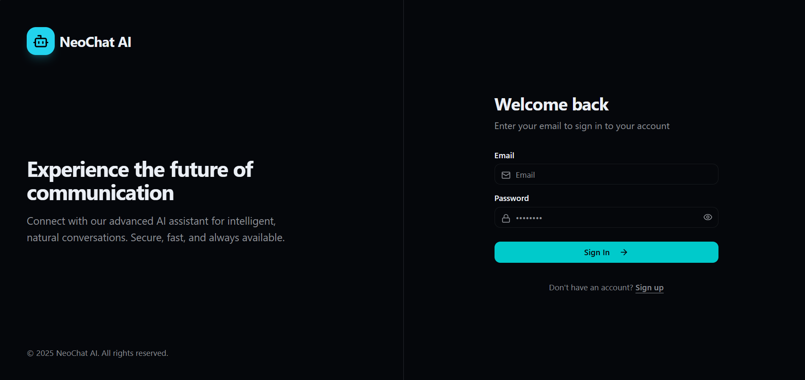

# NeoChat AI - Full Stack Intern Assignment

A professional, full-stack AI chat application built with React, Spring Boot, and Neo4j. This application features secure authentication, real-time AI chat using **Groq (Llama 3)**, and persistent conversation history stored in a graph database.

## 📸 Application Preview

<p align="center">
  
  
</p>

<p align="center">
  
  
  
</p>

---

## Features

- **User Authentication**: Secure Registration and Login with JWT (Access & Refresh Tokens).
- **Real AI Chat**: Integrated with **Groq API** (Llama 3 model) for intelligent, high-speed responses.
- **Conversation History**: Persistent chat history stored in **Neo4j** graph database.
- **Clear History**: Delete all conversation history from both frontend and database *(fully deletes Message nodes from Neo4j)*.
- **Modern UI**: Professional, responsive interface built with **React 18**, **Vite**, and **Tailwind CSS**.
- **Robust Security**: Secure local storage for tokens, with automatic token refresh on expiration.
- **Fully Responsive**: Optimized for desktop, tablet, and mobile devices.

---

## Tech Stack

### Frontend (React + Vite)
- **Framework**: React 18 + Vite
- **Styling**: Tailwind CSS 3, Lucide React Icons
- **Routing**: React Router v6
- **State Management**: React Context API
- **HTTP Client**: Custom Fetch wrapper with Interceptors

### Backend
- **Framework**: Spring Boot 3.2.4
- **Database**: Neo4j (Graph Database)
- **AI Integration**: Groq API (Llama 3)
- **Security**: Spring Security, JWT (JJWT)
- **Build Tool**: Maven

---

## Prerequisites

- **Node.js**: v18 or higher
- **Java JDK**: v17 or higher
- **Docker**: For running Neo4j
- **Groq API Key**: (Free tier available at console.groq.com)

---

## Quick Start

### 1. Database Setup (Neo4j)

The project includes a `docker-compose.yml` file for quick Neo4j setup.

```bash
cd backend
docker-compose up -d
```

- **Neo4j Browser**: `http://localhost:7474`
- **Username**: `neo4j`
- **Password**: `password123`

### 2. Backend Setup

1.  Open a terminal in the `backend` directory.
2.  Configure your environment variables in `src/main/resources/application.properties` (or leave defaults for local dev).
3.  Run the application:

```bash
# Using Maven Wrapper (recommended)
./mvnw spring-boot:run
```

The backend server will start on `http://localhost:8080`.

### 3. Frontend Setup (React + Vite)

1.  Open a new terminal in the `frontend` directory.
2.  Install dependencies and start the dev server:

```bash
cd frontend
npm install
npm run dev
```

The frontend application will be available at `http://localhost:5173`.

---

## Environment Variables

### Backend (`src/main/resources/application.properties`)

Ensure these are configured correctly. The project comes with defaults, but you should use your own API keys for production.

```properties
# Neo4j Configuration
spring.neo4j.uri=bolt://localhost:7687
spring.neo4j.authentication.username=neo4j
spring.neo4j.authentication.password=password123

# JWT Configuration
jwt.secret=YOUR_SECURE_SECRET_KEY_MUST_BE_LONG_ENOUGH
jwt.expiration=300000        # 5 minutes (Access Token)
jwt.refresh-expiration=604800000 # 7 days (Refresh Token)

# Groq API Configuration (Real AI)
groq.api.key=YOUR_GROQ_API_KEY
groq.api.url=https://api.groq.com/openai/v1/chat/completions
groq.model=llama-3.3-70b-versatile
```

### Frontend (`.env` or `.env.local`)

```properties
VITE_API_BASE_URL=http://localhost:8080/api
```

---

## API Endpoints

| Method | Endpoint | Description |
|--------|----------|-------------|
| POST | `/api/auth/register` | Register a new user |
| POST | `/api/auth/login` | Login and get tokens |
| POST | `/api/auth/refresh` | Refresh access token |
| POST | `/api/chat` | Send message to AI |
| GET | `/api/chat/history` | Get conversation history |
| DELETE | `/api/chat/history` | Clear all conversation history |

---

## Testing Instructions

### 1. User Registration
1.  Navigate to `http://localhost:5173/register`.
2.  Enter a unique email (e.g., `test@demo.com`) and password.
3.  Click **Create account**.
4.  **Verification**: You should be redirected to login.

### 2. User Login
1.  Navigate to `http://localhost:5173/login`.
2.  Enter your credentials.
3.  Click **Sign in**.
4.  **Verification**: You will be redirected to the Chat Interface.

### 3. AI Chat (Real Llama 3)
1.  Type a prompt: *"Write a short poem about coding."*
2.  Click **Send**.
3.  **Verification**: You will receive a creative, intelligent response from the AI.
4.  Refresh the page. The conversation history should load from the database.

### 4. Clear History
1.  Open the sidebar by clicking the menu icon.
2.  Click **Clear history** at the bottom.
3.  **Verification**: All messages are removed and deleted from the Neo4j database.
4.  Refresh the page to confirm the history is permanently cleared.

### 5. Token Refresh (Critical Flow)
1.  Open Browser DevTools (**F12**) -> **Application** -> **Local Storage**.
2.  Locate the `accessToken` and delete the last few characters to invalidate it.
3.  Send a new message.
4.  **Verification**: The app automatically refreshes the token and retries the request.

---

## Project Structure

```
.
├── backend/                # Spring Boot Application
│   ├── src/main/java       # Java Source (com.backend.*)
│   ├── docker-compose.yml  # Neo4j Docker config
│   ├── mvnw / mvnw.cmd     # Maven Wrapper (portable Maven)
│   └── pom.xml             # Maven build file
│
├── frontend/               # React + Vite Application
│   ├── src/
│   │   ├── components/     # UI Components (ChatInterface, etc.)
│   │   ├── contexts/       # React Context (AuthContext)
│   │   ├── hooks/          # Custom Hooks (useToast)
│   │   ├── lib/            # API Client & Services
│   │   ├── pages/          # Pages (Login, Register, Chat)
│   │   ├── App.tsx         # Main App with Router
│   │   └── main.tsx        # Entry Point
│   ├── public/             # Static assets
│   ├── index.html          # HTML Template
│   └── vite.config.ts      # Vite Configuration
│
├── preview/                # Application Screenshots
└── README.md               # This file
```

---

## Contact

**Chouaib Saad**

- 📧 Email: [choiyebsaad2000@gmail.com](mailto:choiyebsaad2000@gmail.com)
- 🌐 Portfolio: [chouaib-saad.vercel.app](https://chouaib-saad.vercel.app/)
- 💻 GitHub: [github.com/chouaib-saad](https://github.com/chouaib-saad)
